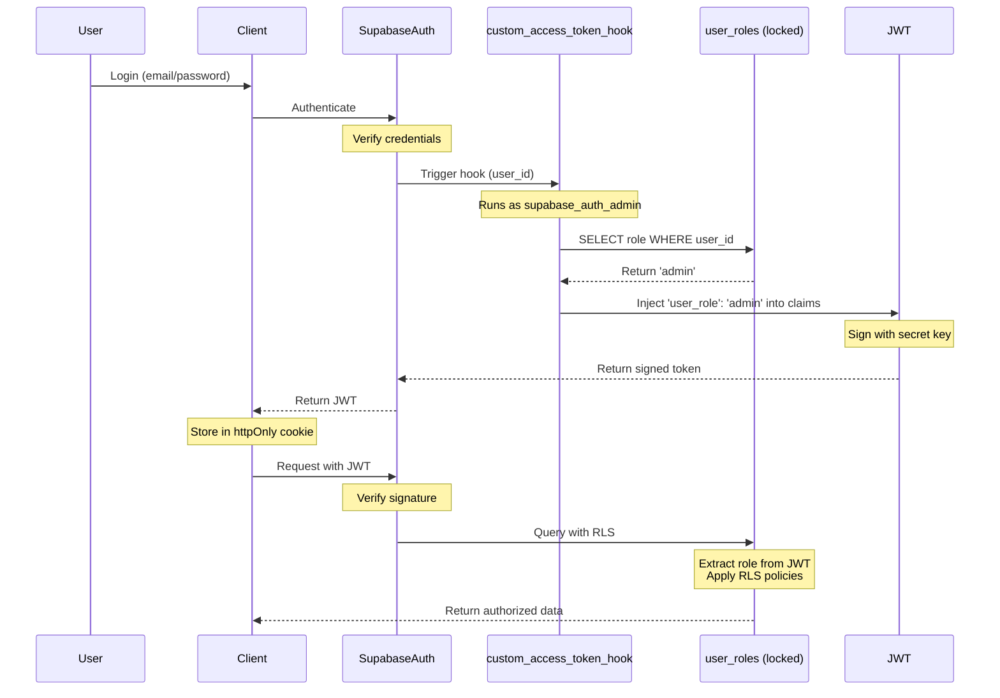

# Security Policy for cosynq 🌌

> **"Do not trust the client."** > This is the foundational security philosophy of `cosynq`. 

`cosynq` is a sanctuary for the cosplay community. Because our users trust us with their personal schedules, financial budgets, and private cosplans, we treat their data with the highest level of cryptographic respect. 

This document outlines the strict security architecture, compliance standards, and reporting guidelines for the `cosynq` platform.

---

## 🛡️ 1. Core Security Architecture

### The "Do Not Trust the Client" Paradigm
We operate under a strict zero-trust model regarding client-side requests. 
* The client UI is purely presentational.
* **No security decisions** (like role checks, data filtering, or validation) are finalized on the frontend.
* All payloads received from the client are treated as potentially malicious until proven otherwise.

### Data Transfer Objects (DTOs)
To prevent accidental data leakage (such as exposing hidden email addresses or private budgets), the backend **never** returns raw database rows to the client. All database responses are mapped through strict DTOs to strip away sensitive columns before the payload travels over the network.

---

## 🪐 2. Celestial Role-Based Access Control (RBAC)

We do **not** store user roles in standard `auth.users` metadata or public profile tables, as these are vulnerable to client-side manipulation. Instead, `cosynq` uses a **Postgres Custom Access Token Hook** to create an unhackable RBAC system.

### The Role Hierarchy

| Role | Celestial Name | Permissions | Use Case |
|------|----------------|-------------|----------|
| `user` | **Dreamer** | Full CRUD access to own content (profiles, cosplans, budgets) | Standard community member |
| `moderator` | **Oracle** | Can hide/lock forum posts, manage recruitment listings, view public content | Community peacekeeper |
| `admin` | **Weaver** | Full system access, user management, role assignment, system configuration | Platform administrator |

### JWT Hook Security Guarantees

#### 1. Cryptographic Integrity
When a user logs in, Supabase generates a JWT signed with a secret key:

```json
{
  "sub": "user-uuid-here",
  "email": "user@example.com",
  "user_role": "admin",
  "iat": 1234567890,
  "exp": 1234571490,
  "signature": "HMACSHA256(...)"
}
```

**Security Guarantee:** The JWT signature is computed using:
```
HMACSHA256(
  base64UrlEncode(header) + "." + base64UrlEncode(payload),
  secret_key
)
```

If a malicious user attempts to modify any claim (including `user_role`), the signature verification fails and Supabase rejects the entire token. This makes role escalation attacks cryptographically impossible without access to the server's secret key.

#### 2. Zero-Trust Architecture
The role stamping process follows a strict zero-trust model:

1. **Roles are stored in a locked-down table** (`public.user_roles`)
   - All permissions revoked from `public`, `anon`, and `authenticated` roles
   - Only `supabase_auth_admin` has access
   - RLS policies prevent direct client access

2. **Hook execution is privileged**
   - Only `supabase_auth_admin` can execute `custom_access_token_hook`
   - Clients cannot call the hook directly
   - Hook runs in `SECURITY DEFINER` mode (elevated privileges)

3. **Role injection happens server-side**
   - Client never sends their role
   - Role is fetched from secure table during authentication
   - Injected into JWT before token is issued to client

4. **RLS policies trust only the JWT**
   - Policies extract role using `auth.jwt() ->> 'user_role'`
   - Never trust client-provided role values
   - Database enforces access control at row level

#### 3. Defense in Depth

Our RBAC system implements six layers of security:

```
┌─────────────────────────────────────────────────────────────┐
│ Layer 1: JWT Signature Verification                        │
│ - Cryptographic guarantee against token tampering          │
└─────────────────────────────────────────────────────────────┘
                            ↓
┌─────────────────────────────────────────────────────────────┐
│ Layer 2: Database Permissions                               │
│ - Roles table locked to supabase_auth_admin only           │
└─────────────────────────────────────────────────────────────┘
                            ↓
┌─────────────────────────────────────────────────────────────┐
│ Layer 3: Row Level Security (RLS)                          │
│ - Policies enforce role-based access at database level     │
└─────────────────────────────────────────────────────────────┘
                            ↓
┌─────────────────────────────────────────────────────────────┐
│ Layer 4: Service Layer Authorization                        │
│ - Business logic validates role before operations          │
└─────────────────────────────────────────────────────────────┘
                            ↓
┌─────────────────────────────────────────────────────────────┐
│ Layer 5: Action Layer Verification                         │
│ - Server Actions verify admin role before mutations        │
└─────────────────────────────────────────────────────────────┘
                            ↓
┌─────────────────────────────────────────────────────────────┐
│ Layer 6: DTO Filtering                                      │
│ - Responses exclude sensitive fields before client send    │
└─────────────────────────────────────────────────────────────┘
```

### How the Auth Hook Works



### RLS Policy Enforcement

All database tables use RLS policies that extract the role from the JWT:

```sql
-- Example: Admin-only operations
CREATE POLICY "Admins can manage roles"
ON public.user_roles
FOR ALL
TO authenticated
USING ((auth.jwt() ->> 'user_role')::text = 'admin');

-- Example: Moderator or Admin operations
CREATE POLICY "Mods can delete posts"
ON public.forum_posts
FOR DELETE
TO authenticated
USING ((auth.jwt() ->> 'user_role')::text IN ('moderator', 'admin'));

-- Example: Owner or Admin access
CREATE POLICY "Users update own cosplans"
ON public.cosplans
FOR UPDATE
TO authenticated
USING (
  auth.uid() = user_id 
  OR (auth.jwt() ->> 'user_role')::text = 'admin'
);
```

**Key Security Properties:**
- ✅ Role is extracted from cryptographically signed JWT
- ✅ Client cannot forge or modify the role claim
- ✅ No database JOINs required (zero performance overhead)
- ✅ Policies are enforced at the database level (cannot be bypassed)

### Audit Trail

All role changes are automatically logged to `public.role_audit_log`:

```sql
CREATE TABLE public.role_audit_log (
  id BIGINT PRIMARY KEY,
  user_id UUID NOT NULL,
  old_role app_role,
  new_role app_role NOT NULL,
  changed_by UUID,
  changed_at TIMESTAMP WITH TIME ZONE DEFAULT NOW()
);
```

**Audit guarantees:**
- Every role assignment is logged
- Every role update captures old and new values
- Actor (changed_by) is recorded from `auth.uid()`
- Timestamps are in UTC for consistency
- Audit log has its own RLS policies (admin-only access)

### Last Admin Protection

The system prevents removing or demoting the last admin user:

```typescript
// In RoleService
async removeRole(userId: string): Promise<void> {
  const currentRole = await this.getUserRole(userId);
  
  if (currentRole?.role === 'admin') {
    const adminCount = await this.countAdmins();
    if (adminCount <= 1) {
      throw new Error('Cannot remove the last admin user');
    }
  }
  
  // Proceed with removal
}
```

This ensures the system always has at least one admin who can manage roles and system configuration.

---

## 🧱 3. Database Protection

### Strict Row Level Security (RLS)
**Every single table** in the Supabase database has strict Row Level Security (RLS) enabled.
* There are zero tables open to unauthenticated public mutations.
* RLS policies evaluate the custom claims in the user's JWT at the database level. 
* Example: A user attempting to `UPDATE` a cosplan via a direct API call will be rejected by the database if `auth.uid()` does not match the record's `user_id`.

### Safe Migrations
Database schemas and security policies are managed strictly via code. Manual edits in the Supabase dashboard are strictly prohibited in production.
* **Pushing Changes:** `npx supabase db push`
* **Pulling Types:** `npx supabase gen types typescript --project-id <project-id> > lib/supabase/database.types.ts`

---

## 📝 4. Input Validation & Route Protection

### Absolute Zod Validation
Before any Server Action or API route processes data, the input payload must pass through strict **Zod** schema validation.
* Payloads missing required fields, containing incorrect data types, or exceeding string length limits are immediately rejected.
* This prevents SQL injection, NoSQL injection, and XSS payload storage.

### Next.js Middleware Edge Protection
All routes in `cosynq` are securely guarded at the edge using Next.js Middleware (`proxy.ts` -> `lib/supabase/middleware.ts`).

1. **Default Protected State:** By default, if a route is not explicitly declared as public, it is **protected**. Unauthenticated users attempting to access a protected route will be seamlessly redirected to the `/sign-in` page.
2. **Auth Route Protection:** Authenticated users trying to access authentication pages (e.g., `/sign-in`, `/sign-up`) will be blocked and redirected to the `/` (Home) page, as they are already logged in.

**How to Add or Expose Routes:**
Our routing logic is centralized in `lib/constants/routes.ts`. Follow these instructions to modify route behaviors:

* **Defining a New Route:** Add your route constant to the `ROUTES` object.
  ```typescript
  export const ROUTES = {
    // ...
    DASHBOARD: '/dashboard',
  } as const;
  ```
* **Making a Route Public (No Auth Required):** Add the route reference to the `PUBLIC_ROUTES` array. Visitors will be able to access the page without logging in.
  ```typescript
  export const PUBLIC_ROUTES = [
    ROUTES.HOME,
    // Add public routes here
  ] as const;
  ```
* **Adding an Authentication Route (Logged In Users Cannot Access):** Add the route reference to the `AUTH_ROUTES` array. 
  ```typescript
  export const AUTH_ROUTES = [
    ROUTES.SIGN_IN,
    ROUTES.SIGN_UP,
  ] as const;
  ```

Routes with strict role requirements (e.g. Moderators via `/mod/*` or Admins via `/admin/*`) will be additionally intercepted at the component/action level following our RBAC zero-trust policies, ensuring unauthorized members cannot bypass deeper security checkpoints.

---

## ✅ Security Checklist

### RBAC System Security Verification

Before deploying to production, verify all RBAC security measures are in place:

- [ ] **JWT Hook Enabled**
  - Custom Access Token hook is enabled in Supabase Dashboard
  - Hook function `public.custom_access_token_hook` exists and is executable
  - Test login and verify `user_role` claim is present in JWT

- [ ] **Database Permissions**
  - All permissions revoked from `public`, `anon`, `authenticated` on `user_roles` table
  - Only `supabase_auth_admin` has access to `user_roles`
  - Hook function is only executable by `supabase_auth_admin`

- [ ] **RLS Policies**
  - RLS is enabled on `user_roles` table
  - RLS is enabled on `role_audit_log` table
  - Admin-only policies are in place for role management
  - User-own-data policies allow users to view their own role

- [ ] **Audit Logging**
  - Trigger `on_role_change` is attached to `user_roles` table
  - All role changes are being logged to `role_audit_log`
  - Audit log has admin-only RLS policies

- [ ] **Auto-Role Assignment**
  - Trigger `on_auth_user_created` is attached to `auth.users` table
  - New users automatically receive 'user' role on registration
  - Trigger handles errors gracefully without blocking user creation

- [ ] **Last Admin Protection**
  - Service layer prevents removing last admin
  - Service layer prevents demoting last admin
  - Admin count check is performed before role removal/update

- [ ] **Input Validation**
  - All role actions use Zod schema validation
  - UUID format is validated before database queries
  - Role values are validated against enum

- [ ] **DTO Security**
  - All service responses are mapped to DTOs
  - DTOs exclude sensitive fields (email, phone, internal IDs)
  - Only minimal necessary data is sent to client

### General Security Checklist

- [ ] All environment variables are properly configured
- [ ] Database connection strings are not exposed in client code
- [ ] API routes are protected with authentication middleware
- [ ] File uploads are validated and sanitized
- [ ] Rate limiting is enabled on authentication endpoints
- [ ] CORS is properly configured
- [ ] Content Security Policy headers are set
- [ ] All dependencies are up to date and scanned for vulnerabilities

---

## 🚨 Reporting a Vulnerability

If you discover a security vulnerability within `cosynq`, please do not disclose it publicly on the GitHub issues board or forums. 

We take all security reports seriously and will work with you to patch the vulnerability immediately.

**Please report vulnerabilities via email:**
* **Email:** security@ryne.dev
* **Response Time:** We aim to acknowledge all reports within 48 hours.

When reporting, please include:
1. A description of the vulnerability.
2. The steps required to reproduce the issue.
3. Any potential impact you have identified.
4. Your recommended remediation (if applicable).

**Scope of Security Reports:**
- Authentication and authorization bypasses
- SQL injection or NoSQL injection vulnerabilities
- Cross-Site Scripting (XSS) vulnerabilities
- Cross-Site Request Forgery (CSRF) vulnerabilities
- Server-Side Request Forgery (SSRF) vulnerabilities
- Remote Code Execution (RCE) vulnerabilities
- Privilege escalation vulnerabilities
- Data exposure or leakage issues

Thank you for helping keep the `cosynq` universe safe! ✨