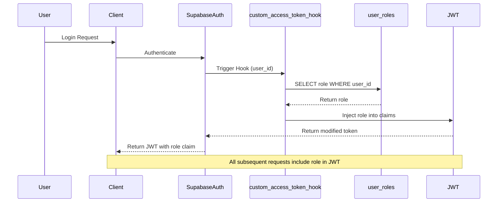

# 🌌 cosynq Role-Based Access Control (RBAC)

> **Zero-lookup, cryptographically secure role management using Supabase JWT hooks**

This document provides comprehensive implementation details for the cosynq RBAC system, which leverages Supabase's custom JWT access token hooks to stamp user roles directly into authentication tokens at login time.

---

## 📋 Table of Contents

1. [Architecture Overview](#architecture-overview)
2. [JWT Hook Security Model](#jwt-hook-security-model)
3. [Database Schema](#database-schema)
4. [6-Layer Architecture Integration](#6-layer-architecture-integration)
5. [RLS Policy Examples](#rls-policy-examples)
6. [React Query Hook Usage](#react-query-hook-usage)
7. [Celestial Role Mapping](#celestial-role-mapping)
8. [Troubleshooting](#troubleshooting)

---

## Architecture Overview

### The Problem We're Solving

Traditional RBAC systems require a database JOIN on every request to check user roles:
```sql
-- ❌ Slow: Requires JOIN on every request
SELECT posts.* FROM posts
JOIN user_roles ON posts.user_id = user_roles.user_id
WHERE user_roles.role = 'admin';
```

### Our Solution: JWT Hook Stamping

Instead of querying the database, we inject the role directly into the JWT at authentication time:



**Benefits:**
- ✅ **Zero database lookups** for role checks
- ✅ **Cryptographically secure** (JWT signature prevents tampering)
- ✅ **Sub-200ms response times** for role-protected operations
- ✅ **Decoupled from user profiles** (role changes don't affect profile data)

---

## JWT Hook Security Model

### How JWT Signing Prevents Tampering

When a user logs in, Supabase generates a JWT signed with a secret key:

```json
{
  "sub": "user-uuid-here",
  "email": "user@example.com",
  "user_role": "admin",
  "signature": "cryptographic-hash-here"
}
```

**Security Guarantee:** If a malicious user tries to edit their token to change `"user_role": "user"` to `"user_role": "admin"`, the signature becomes invalid and Supabase rejects the entire token.

### Defense in Depth

Our RBAC system implements multiple security layers:

1. **Database Layer:** Roles table has all permissions revoked from public/anon/authenticated
2. **Hook Layer:** Only `supabase_auth_admin` can execute the hook function
3. **RLS Layer:** Policies extract role from JWT (not from client input)
4. **Service Layer:** Business logic validates role before operations
5. **Action Layer:** Server Actions verify admin role before mutations
6. **DTO Layer:** Responses filter sensitive fields before sending to client

---

## Database Schema

### Core Tables

#### `public.user_roles`

```sql
CREATE TYPE public.app_role AS ENUM ('user', 'moderator', 'admin');

CREATE TABLE public.user_roles (
  id BIGINT GENERATED BY DEFAULT AS IDENTITY PRIMARY KEY,
  user_id UUID REFERENCES auth.users ON DELETE CASCADE NOT NULL UNIQUE,
  role public.app_role DEFAULT 'user'::public.app_role NOT NULL,
  created_at TIMESTAMP WITH TIME ZONE DEFAULT timezone('utc'::text, now()) NOT NULL
);

-- Indexes for performance
CREATE INDEX idx_user_roles_user_id ON public.user_roles(user_id);
CREATE INDEX idx_user_roles_role ON public.user_roles(role);
```

**Security Configuration:**
```sql
-- Revoke all permissions from clients
REVOKE ALL ON TABLE public.user_roles FROM authenticated, anon, public;

-- Grant access only to auth admin
GRANT ALL ON TABLE public.user_roles TO supabase_auth_admin;

-- Enable RLS
ALTER TABLE public.user_roles ENABLE ROW LEVEL SECURITY;
```

#### `public.role_audit_log`

```sql
CREATE TABLE public.role_audit_log (
  id BIGINT GENERATED BY DEFAULT AS IDENTITY PRIMARY KEY,
  user_id UUID REFERENCES auth.users ON DELETE CASCADE NOT NULL,
  old_role public.app_role,
  new_role public.app_role NOT NULL,
  changed_by UUID REFERENCES auth.users ON DELETE SET NULL,
  changed_at TIMESTAMP WITH TIME ZONE DEFAULT timezone('utc'::text, now()) NOT NULL
);

CREATE INDEX idx_role_audit_user_id ON public.role_audit_log(user_id);
CREATE INDEX idx_role_audit_changed_at ON public.role_audit_log(changed_at DESC);
```

### The Custom Access Token Hook

```sql
CREATE OR REPLACE FUNCTION public.custom_access_token_hook(event jsonb)
RETURNS jsonb
LANGUAGE plpgsql
STABLE
SECURITY DEFINER
AS $$
DECLARE
  claims jsonb;
  user_role public.app_role;
BEGIN
  -- Extract claims from event
  claims := event->'claims';
  
  -- Fetch user role from secure table
  SELECT role INTO user_role 
  FROM public.user_roles 
  WHERE user_id = (event->>'user_id')::uuid;
  
  -- Inject role into claims
  IF user_role IS NOT NULL THEN
    claims := jsonb_set(claims, '{user_role}', to_jsonb(user_role));
  ELSE
    -- Default to 'user' if no role found
    claims := jsonb_set(claims, '{user_role}', '"user"');
  END IF;
  
  -- Update event with modified claims
  event := jsonb_set(event, '{claims}', claims);
  
  RETURN event;
EXCEPTION
  WHEN OTHERS THEN
    -- On error, default to 'user' role and log
    RAISE WARNING 'Error in custom_access_token_hook for user %: %', 
      event->>'user_id', SQLERRM;
    claims := jsonb_set(claims, '{user_role}', '"user"');
    event := jsonb_set(event, '{claims}', claims);
    RETURN event;
END;
$$;

-- Security: Only auth admin can execute
GRANT EXECUTE ON FUNCTION public.custom_access_token_hook TO supabase_auth_admin;
REVOKE EXECUTE ON FUNCTION public.custom_access_token_hook FROM authenticated, anon, public;
```

### Database Triggers

#### Auto-assign role on registration

```sql
CREATE OR REPLACE FUNCTION public.handle_new_user_role()
RETURNS TRIGGER
LANGUAGE plpgsql
SECURITY DEFINER
AS $$
BEGIN
  INSERT INTO public.user_roles (user_id, role)
  VALUES (NEW.id, 'user');
  RETURN NEW;
EXCEPTION
  WHEN OTHERS THEN
    RAISE WARNING 'Failed to create default role for user %: %', NEW.id, SQLERRM;
    RETURN NEW;
END;
$$;

CREATE TRIGGER on_auth_user_created
  AFTER INSERT ON auth.users
  FOR EACH ROW
  EXECUTE FUNCTION public.handle_new_user_role();
```

#### Audit log trigger

```sql
CREATE OR REPLACE FUNCTION public.log_role_changes()
RETURNS TRIGGER
LANGUAGE plpgsql
SECURITY DEFINER
AS $$
BEGIN
  IF TG_OP = 'UPDATE' AND OLD.role IS DISTINCT FROM NEW.role THEN
    INSERT INTO public.role_audit_log (user_id, old_role, new_role, changed_by)
    VALUES (NEW.user_id, OLD.role, NEW.role, auth.uid());
  ELSIF TG_OP = 'INSERT' THEN
    INSERT INTO public.role_audit_log (user_id, old_role, new_role, changed_by)
    VALUES (NEW.user_id, NULL, NEW.role, auth.uid());
  END IF;
  RETURN NEW;
END;
$$;

CREATE TRIGGER on_role_change
  AFTER INSERT OR UPDATE ON public.user_roles
  FOR EACH ROW
  EXECUTE FUNCTION public.log_role_changes();
```

---

## 6-Layer Architecture Integration

The RBAC system follows cosynq's strict 6-layer architecture:

```
┌─────────────────────────────────────────────────────────────┐
│ Layer 1: View (app/)                                        │
│ - /admin/roles page                                         │
│ - Server Components for initial data fetching              │
└─────────────────────────────────────────────────────────────┘
                            ↓
┌─────────────────────────────────────────────────────────────┐
│ Layer 2: Component (components/)                            │
│ - RoleManagerComponent                                      │
│ - RoleCardComponent                                         │
│ - Client-side UI with shadcn components                    │
└─────────────────────────────────────────────────────────────┘
                            ↓
┌─────────────────────────────────────────────────────────────┐
│ Layer 3: Hook (lib/hooks/)                                  │
│ - useUserRole()                                             │
│ - useAssignRole()                                           │
│ - useUpdateRole()                                           │
│ - React Query hooks with caching                           │
└─────────────────────────────────────────────────────────────┘
                            ↓
┌─────────────────────────────────────────────────────────────┐
│ Layer 4: Action (lib/actions/)                              │
│ - assignRoleAction()                                        │
│ - updateRoleAction()                                        │
│ - removeRoleAction()                                        │
│ - Server Actions with 'use server'                         │
└─────────────────────────────────────────────────────────────┘
                            ↓
┌─────────────────────────────────────────────────────────────┐
│ Layer 5: Service (lib/services/)                            │
│ - RoleService class                                         │
│ - Business logic and complex queries                        │
│ - DTO mapping                                               │
└─────────────────────────────────────────────────────────────┘
                            ↓
┌─────────────────────────────────────────────────────────────┐
│ Layer 6: Data Access (lib/supabase/, lib/types/)           │
│ - Supabase client                                           │
│ - Database types                                            │
│ - Zod validation schemas                                    │
└─────────────────────────────────────────────────────────────┘
```

### File Structure

```
lib/
├── actions/
│   └── role.actions.ts          # Server Actions
├── hooks/
│   └── use-roles.ts             # React Query hooks
├── services/
│   └── role.service.ts          # Business logic
├── types/
│   └── role.types.ts            # TypeScript types & DTOs
├── utils/
│   └── role.utils.ts            # Role mapping utilities
├── validations/
│   └── role.validation.ts       # Zod schemas
└── supabase/
    ├── client.ts                # Client-side Supabase
    ├── server.ts                # Server-side Supabase
    └── database.types.ts        # Generated types
```

---

## RLS Policy Examples

### Basic Role Checks

```sql
-- Admin-only operations
CREATE POLICY "Admins can manage user roles"
ON public.user_roles
FOR ALL
TO authenticated
USING ((auth.jwt() ->> 'user_role')::text = 'admin');

-- Moderator or Admin operations
CREATE POLICY "Mods can delete posts"
ON public.forum_posts
FOR DELETE
TO authenticated
USING ((auth.jwt() ->> 'user_role')::text IN ('moderator', 'admin'));
```

### Combined Role and Ownership Checks

```sql
-- Users can update own content, admins can update any
CREATE POLICY "Users update own cosplans"
ON public.cosplans
FOR UPDATE
TO authenticated
USING (
  auth.uid() = user_id 
  OR (auth.jwt() ->> 'user_role')::text = 'admin'
)
WITH CHECK (
  auth.uid() = user_id 
  OR (auth.jwt() ->> 'user_role')::text = 'admin'
);

-- Users can view own data, moderators can view all
CREATE POLICY "Users view own budgets"
ON public.cosplan_budgets
FOR SELECT
TO authenticated
USING (
  auth.uid() = user_id
  OR (auth.jwt() ->> 'user_role')::text IN ('moderator', 'admin')
);
```

### Read vs Write Separation

```sql
-- Everyone can read, only admins can write
CREATE POLICY "Public read access"
ON public.announcements
FOR SELECT
TO authenticated
USING (true);

CREATE POLICY "Admin write access"
ON public.announcements
FOR INSERT
TO authenticated
WITH CHECK ((auth.jwt() ->> 'user_role')::text = 'admin');
```

### Performance Tip

Always extract the role claim once if using it multiple times:

```sql
-- ❌ Inefficient: Extracts claim twice
USING (
  (auth.jwt() ->> 'user_role')::text = 'admin'
  OR ((auth.jwt() ->> 'user_role')::text = 'moderator' AND status = 'published')
)

-- ✅ Efficient: Use a subquery or CTE
USING (
  WITH user_role AS (
    SELECT (auth.jwt() ->> 'user_role')::text AS role
  )
  SELECT role = 'admin' OR (role = 'moderator' AND status = 'published')
  FROM user_role
)
```

---

## React Query Hook Usage

### Fetching User Roles

```typescript
import { useUserRole } from '@/lib/hooks/use-roles';

function UserRoleBadge({ userId }: { userId: string }) {
  const { data: userRole, isLoading, isError } = useUserRole(userId);

  if (isLoading) return <Skeleton className="h-6 w-20" />;
  if (isError) return <Badge variant="destructive">Error</Badge>;
  if (!userRole) return <Badge variant="secondary">No Role</Badge>;

  return (
    <Badge variant="default">
      {toCelestialRole(userRole.role)}
    </Badge>
  );
}
```

### Assigning Roles

```typescript
import { useAssignRole } from '@/lib/hooks/use-roles';
import { toast } from 'sonner';

function AssignRoleButton({ userId }: { userId: string }) {
  const assignRole = useAssignRole();

  const handleAssign = () => {
    assignRole.mutate(
      { userId, role: 'moderator' },
      {
        onSuccess: () => {
          toast.success('Role assigned successfully');
        },
        onError: (error) => {
          toast.error(`Failed to assign role: ${error.message}`);
        }
      }
    );
  };

  return (
    <Button 
      onClick={handleAssign} 
      disabled={assignRole.isLoading}
    >
      {assignRole.isLoading ? 'Assigning...' : 'Make Moderator'}
    </Button>
  );
}
```

### Listing Users by Role

```typescript
import { useUsersWithRole } from '@/lib/hooks/use-roles';

function AdminList() {
  const { data, isLoading } = useUsersWithRole('admin', 1, 20);

  if (isLoading) return <LoadingSpinner />;

  return (
    <div>
      <h2>Admins ({data?.pagination.totalCount})</h2>
      {data?.data.map(user => (
        <UserCard key={user.userId} user={user} />
      ))}
    </div>
  );
}
```

### Caching Configuration

The hooks are pre-configured with optimal cache times:

```typescript
// useUserRole: 5 minutes stale time
// - Roles change infrequently
// - Reduces unnecessary refetches

// useUsersWithRole: 2 minutes stale time
// - List data changes more frequently
// - Balances freshness and performance

// Mutations automatically invalidate relevant queries
// - assignRole invalidates user role queries
// - updateRole invalidates user role and list queries
// - removeRole invalidates all role-related queries
```

---

## Celestial Role Mapping

cosynq uses celestial-themed role names in the UI while maintaining standard role names in the database.

### Role Mapping

| Database Role | Celestial Name | Description |
|--------------|----------------|-------------|
| `user` | **Dreamer** | Standard user with full access to personal content |
| `moderator` | **Oracle** | Community peacekeeper with moderation capabilities |
| `admin` | **Weaver** | Full system access and administrative privileges |

### Utility Functions

```typescript
import { 
  toCelestialRole, 
  fromCelestialRole,
  getRoleDisplayName,
  getRoleDescription,
  isAdmin,
  isModerator
} from '@/lib/utils/role.utils';

// Convert database role to UI name
const celestialName = toCelestialRole('admin'); // "Weaver"

// Convert UI name to database role
const dbRole = fromCelestialRole('Weaver'); // "admin"

// Get display name
const displayName = getRoleDisplayName('moderator'); // "Oracle"

// Get description
const description = getRoleDescription('user');
// "Standard user with full access to personal content"

// Role checks
if (isAdmin(userRole)) {
  // Show admin panel
}

if (isModerator(userRole)) {
  // Show moderation tools
}
```

### Usage in Components

```typescript
function RoleDisplay({ role }: { role: AppRole }) {
  const celestialName = toCelestialRole(role);
  const description = getRoleDescription(role);

  return (
    <div className="space-y-2">
      <Badge variant="celestial">{celestialName}</Badge>
      <p className="text-sm text-muted-foreground">{description}</p>
    </div>
  );
}
```

---

## Troubleshooting

### Issue: JWT doesn't contain `user_role` claim

**Symptoms:**
- RLS policies deny access even for admins
- `auth.jwt() ->> 'user_role'` returns null

**Solutions:**

1. **Verify hook is enabled in Supabase Dashboard:**
   - Navigate to: Dashboard → Authentication → Hooks
   - Enable "Custom Access Token"
   - Select `public.custom_access_token_hook`
   - Save configuration

2. **Check hook function exists:**
   ```sql
   SELECT routine_name 
   FROM information_schema.routines 
   WHERE routine_name = 'custom_access_token_hook';
   ```

3. **Test hook manually:**
   ```sql
   SELECT public.custom_access_token_hook(
     '{"user_id": "your-user-uuid", "claims": {}}'::jsonb
   );
   ```

4. **Force token refresh:**
   - Log out and log back in
   - Or call `supabase.auth.refreshSession()` in your app

### Issue: "Permission denied" when querying `user_roles`

**Symptoms:**
- Direct queries to `user_roles` fail
- Error: "permission denied for table user_roles"

**This is expected behavior!** The table is intentionally locked down. Access roles through:

1. **From the client:** Use the JWT claim in RLS policies
2. **From admin tools:** Use the RoleService methods
3. **For debugging:** Use the Supabase Dashboard SQL Editor (runs as superuser)

### Issue: Role changes don't take effect immediately

**Symptoms:**
- Updated role in database but user still has old permissions
- RLS policies use old role value

**Cause:** JWT tokens are cached until they expire (default: 1 hour)

**Solutions:**

1. **Force token refresh:**
   ```typescript
   const { data, error } = await supabase.auth.refreshSession();
   ```

2. **Log out and log back in**

3. **Wait for token expiration** (tokens auto-refresh)

### Issue: Last admin protection not working

**Symptoms:**
- Can remove or demote the last admin user
- System left with no admins

**Check:**

1. **Verify service layer logic:**
   ```typescript
   // In role.service.ts
   const adminCount = await this.countAdmins();
   if (adminCount <= 1 && currentRole === 'admin') {
     throw new Error('Cannot remove last admin');
   }
   ```

2. **Check if using service methods:**
   - Direct database mutations bypass protection
   - Always use `RoleService.removeRole()` or `removeRoleAction()`

### Issue: Audit log not recording changes

**Symptoms:**
- `role_audit_log` table is empty
- No records after role changes

**Check:**

1. **Verify trigger exists:**
   ```sql
   SELECT trigger_name 
   FROM information_schema.triggers 
   WHERE event_object_table = 'user_roles';
   ```

2. **Check trigger function:**
   ```sql
   SELECT public.log_role_changes();
   ```

3. **Verify RLS on audit log:**
   ```sql
   SELECT tablename, rowsecurity 
   FROM pg_tables 
   WHERE tablename = 'role_audit_log';
   ```

### Issue: Migration fails with "already exists" errors

**Symptoms:**
- Migration fails on re-run
- Errors about existing types/tables/functions

**Solution:** Use idempotent SQL:

```sql
-- ✅ Idempotent
CREATE TYPE IF NOT EXISTS public.app_role AS ENUM (...);
CREATE OR REPLACE FUNCTION public.custom_access_token_hook(...);

-- ❌ Not idempotent
CREATE TYPE public.app_role AS ENUM (...);
CREATE FUNCTION public.custom_access_token_hook(...);
```

### Issue: Performance degradation with role checks

**Symptoms:**
- Slow query performance
- High database CPU usage

**Optimization tips:**

1. **Use indexes:**
   ```sql
   CREATE INDEX idx_user_roles_user_id ON public.user_roles(user_id);
   CREATE INDEX idx_user_roles_role ON public.user_roles(role);
   ```

2. **Avoid JOINs in RLS policies:**
   ```sql
   -- ❌ Slow: Joins on every row check
   USING (
     EXISTS (
       SELECT 1 FROM user_roles 
       WHERE user_roles.user_id = auth.uid() 
       AND user_roles.role = 'admin'
     )
   )

   -- ✅ Fast: Reads from JWT
   USING ((auth.jwt() ->> 'user_role')::text = 'admin')
   ```

3. **Cache role checks in application:**
   ```typescript
   // React Query automatically caches for 5 minutes
   const { data: userRole } = useUserRole(userId);
   ```

### Getting Help

If you encounter issues not covered here:

1. Check the [Supabase Auth Hooks documentation](https://supabase.com/docs/guides/auth/auth-hooks)
2. Review the migration file: `supabase/migrations/*_create_roles_system.sql`
3. Check application logs for warnings from the hook function
4. Test RLS policies in the Supabase Dashboard SQL Editor

---

## Deployment Checklist

When deploying the RBAC system to production:

- [ ] Apply migration: `npx supabase db push`
- [ ] Enable hook in Supabase Dashboard
- [ ] Regenerate TypeScript types: `npx supabase gen types typescript --project-id euhfhbpcqsfkfhmyvrzw > lib/supabase/database.types.ts`
- [ ] Verify hook is working (test login and check JWT)
- [ ] Assign initial admin role to your account
- [ ] Test RLS policies with different role levels
- [ ] Verify audit logging is working
- [ ] Test last admin protection
- [ ] Monitor error logs for hook failures

---

**Built with 🩵 by [RYNE.DEV](https://ryne.dev) for the cosynq universe.**
